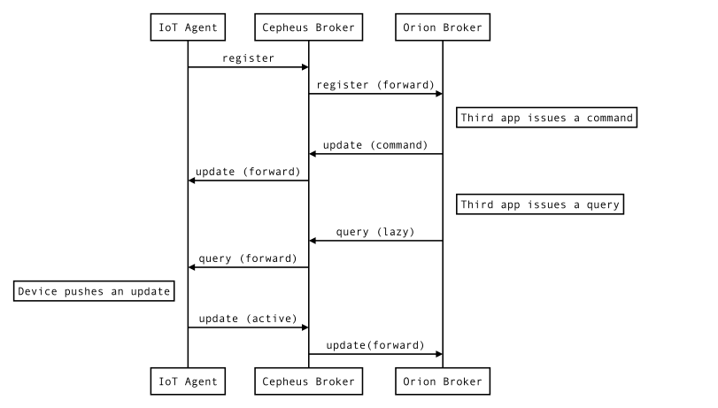

# Introduction

The Cepheus-broker component is a lightweight broker only supporting two kinds of operations:

- requests forwarding by keeping track of which components register Context Entities.
- pub/sub requests for Context Entities.

This keeps the implementation simple and sufficient for the use cases handled by the NGSI gateway.

The main goal of the Cepheus-broker is to sit between the IoT Agents or NGSI devices, forward their requests to a remote NGSI broker (like Orion)
while allowing other NGSI components to subscribe to some the the updated Context Elements.

# Forwarding support

Request forwarding is based on the fact that all NGSI components will register their Context Entities on startup.

The broker will track these `/registerContext` requests (keeping a list of all `providingApplication` URLs)
before forwarding them back to the remote broker.

Then when `/updateContext` or `/queryContext` requests arrive, they will be either forwarded to the remote broker if no `providingApplication` matches
or forwarded to the corresponding `providingApplication`.

The forwarding process is described in the Fiware-Orion project documentation: [here](https://fiware-orion.readthedocs.org/en/develop/user/context_providers/index.html)

# Pubsub support

Publish/subscribe is supported by the `/subscribeContext` requests to Context Entities that will trigger `/notifyContext` requests.

This feature is mainly used by Cepheus-CEP to track updates to Context Entities.

# Limitations

The broker has many limitations due to its simple design compared to a complete broker implementation.

- Broker only supports `registerContext`, `updateContext`, `queryContext`, `subscribeContext`, `unsubscribeContext` and `notifyContext` operations from NGSI v1 API (json formated).
- Subscriptions only support `ONCHANGE` as type of notification.
- Subscriptions do not handle throttling.
- All subscriptions and registrations are lost on restart of the application (not persisted on disk, kept in memory only).
- If multiple NGSI providers register the same Context Entities, only the first provider will get the forwarded `queryContext` or `updateContext` requests.
- When a `queryContext` or `updateContext` request contains references to multiple Context Entities, the request is forwarded only to the Context Provider of the first Context Entity.
- Broker does not keep the any value of Context Entities, all requests will get forwarded to a Context Provider or the remote Broker.
