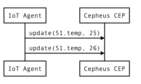
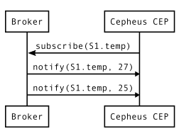
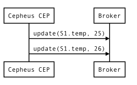

## JSON Configuration

The configuration a simple JSON object containing the complete description of the behavior of the CEP engine
(a set of EPL statements) and the mapping between the NGSI Context Entities and CEP Events.

Here is an example:

```json
{
  "host":"http://localhost:8080",
  "in":[
    {
      "id":"RoomX",
      "type":"Room",
      "isPattern": false,
      "attributes":[
        { "name":"temperature", "type":"double" },
        { "name":"floor", "type":"string" }
      ]
      "providers":[
        "http://localhost:8081"
      ]
    }
  ],
  "out":[
    {
      "id":"FloorX",
      "type":"Floor",
      "attributes":[
        { "name":"temperature", "type":"double" }
      ]
      "brokers":[
        { "url":"http://localhost:8081" }
      ]
    }
  ],
  "statements":[
    "INSERT INTO Floor SELECT floor as id, avg(temperature) as temperature FROM Room.win:time(10 min) GROUP BY floor OUTPUT LAST EVERY 10 sec"
  ]
}
```

### Host url

The `host` url defined the HTTP address (scheme, host and port) where the Cepheus-CEP can be contacted.
It is used to subscribe to Context Providers (see next section).

### Incomming events

The `in` array defines the list of incoming events (NGSI Context Entities) the CEP expects as input from Context Providers.

Each Context Entity must be defined by:

 - `id`: the ID of the Context Entity, can be a patten if `isPattern` is `true`, mandatory.
 - `type`: the type of the Context Entity, mandatory.
 - `isPattern`: if the `id` is a pattern, optional, default: `false`.
 - `attributes`: the list of Context Attributes to match, mandatory, cannot be empty.
 - `providers` : the list of Context Provider to subscribe for this Context Entity, optional.

Each Context Attributes must be defined by:

 - `name`: the name of the attribute, mandatory.
 - `type`: the type of the attribute, mandatory.
           Only simple types are supported for now : `string`, `double`, `float`, `int`, `bool`.
 - `metadata`: the list of attribute Metadata (with `name` and `type` properties like attributes).

There is two ways Context Providers can notify the CEP:

 - The simplest way for the Context Provider is to send `/updateContext` requests to the CEP.



<!--```sequence
participant IoT Agent as C
participant Cepheus CEP as B

C->B: update(S1.temp, 27)
C->B: update(S1.temp, 25)
```-->

 - The second way is to make the CEP subscribe to the Context Provider (like a Broker).
   For each Context Provider defined in the "providers" field of an event, the CEP will send initialy a `/subscribeContext`,
   and will expect in return the Context Provider to notify it with `/notifyContext` requests.



<!--```sequence
participant Broker as C
participant Cepheus CEP as B
B->C: subscribe(S1.temp)
C->B: notify(S1.temp, 27)
C->B: notify(S1.temp, 25)
```-->

### Outgoing events

The `out` array defines the list of outgoing events (those generated by the CEP). Each outgoing event can have multiple brokers.
For each broker, the CEP will trigger `ngsi10/updateContext` requests to the broker on each event update.



<!--```sequence
participant Cepheus CEP as A
participant Remote broker as B
A->B: update(S1.temp, 25)
A->B: update(S1.temp, 26)
```-->

### Statements

The `statements` array defines a list of [Esper EPL statements](http://www.espertech.com/esper/release-5.2.0/esper-reference/html/epl_clauses.html)
that will interact with the events previously defined.
