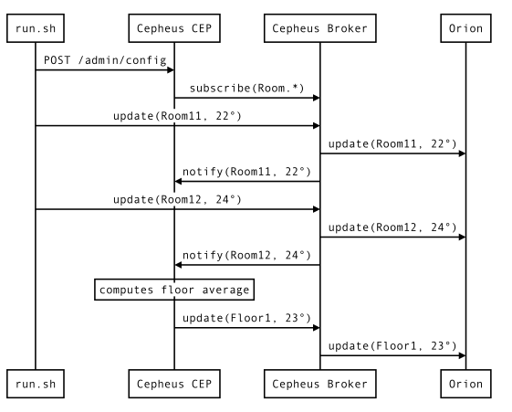
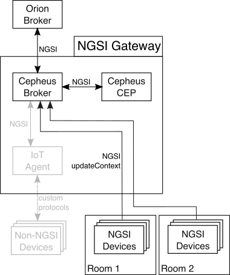

This example shows how Cepheus-CEP and Cepheus-Broker interact with Orion.

It is based on the Rooms and Floors example.

The temperature data will always transit though the Cepheus-Broker to be forwarded to Cepheus-CEP and to Orion (remote broker)
But this time, Cepheus-CEP will send the temperature average (over the last 10 minutes) on each floor to Orion.
In this example, we use a mock to simulate Orion.

## Architecture
In this example, the NGSI sensors (simulated by the run.sh script) will send temperature data to the Cepheus-Broker.
The Cepheus-CEP will subscribe to the broker for this data and therefore be notified when new data is received.
The Cepheus-CEP will send the temperature average to Orion.

This is illustrated in the following figure:

All the grayed parts are part of the reference architecture and are not used in this example.

## Configuring the CEP

The configuration is similar to the third example.
This will tell the CEP to subscribe for the Room Context Entity to one or more Context Providers (here the Cepheus-Broker instance).

    "in": [
        {
            "id":"Room.*",     # Pattern is used to subscribe to provider to all Room1, Room2, ..., RoomN
            "type":"Room",     # The type to subscribe
            "isPattern":true,  # Pattern match the id
            "providers":[ "http://localhost:8081" ],  # The URL of the source of the input
            "attributes":[
                { "name":"temperature", "type":"double" },
                { "name":"floor", "type":"string" }
            ]
        }
    ]

The `out` section is also similar to the third example but we add a `brokers` section
to send the update for this Context Entity to the Orion.

    "out":[
        {
            "id":"Floor1",
            "type":"Floor",
            "attributes":[
                { "name":"temperature", "type":"double" }
            ],
            "brokers": [
                { "url":"http://localhost:8082" }
            ]
        }
    ]

The [config.json](config.json) has the complete configuration setup.

In this configuration, the time of the output has been lowered to 10 seconds
to make the average show up quickly in the logs.

## Testing the setup

You can run the [run.sh](run.sh) file in a terminal while checking the logs of Cepheus CEP
to see the Rooms temperature sent to the CEP and the CEP reacting to the events.

In a first terminal, launch mock-orion (default on port :8082 on your machine)

    cd doc/examples/mocks/mock-orion
    mvn spring-boot:run

In a second terminal, launch Cepheus-lb:

    cd cepheus-lb
    mvn spring-boot:run

Default configuration should launch it on port :8081 on your machine.

Then in a third terminal, launch Cepheus-CEP:

    cd cepheus-cep
    mvn spring-boot:run

Default configuration should launch it on port :8080 on your machine.

Now in another terminal, trigger the [run.sh](run.sh) script:

    cd doc/examples/4_CepAndBrokerAndOrion
    sh run.sh

The script first sends the [config.json](config.json) file to Cepheus-CEP.

Cepheus-CEP sends a `subscribeContext` request in order to receive notifications from the Cepheus-Broker for the Room Context Entity.

Then the script sending temperatures updates to Cepheus-lb that sends notifications to Cepheus-CEP and forward updates to mock-orion.
You can theses sends and forwards in the logs of the two applications.

Go back to the terminal where you launched first the LB then after the CEP. You should see temperatures as "EventIn" beeing logged in CEP logs.

After a few seconds, the "EventOut" logs will show the CEP triggering the average temperature for each floor.
CEP send the EventOut updates to a remote NGSI broker (mock-orion).
You should see temperature averages as "Floor" beeing logged in mock-orion logs.

## Next step

You must now learn how to send the EventOut updates to a NGSI device like IoT Agent.
